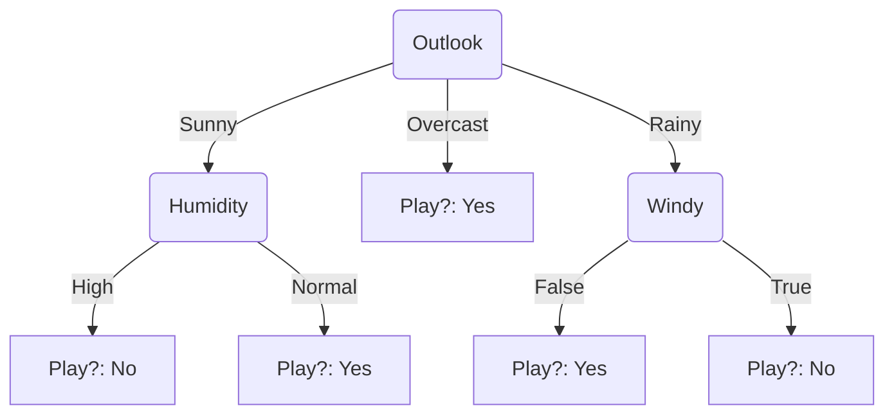
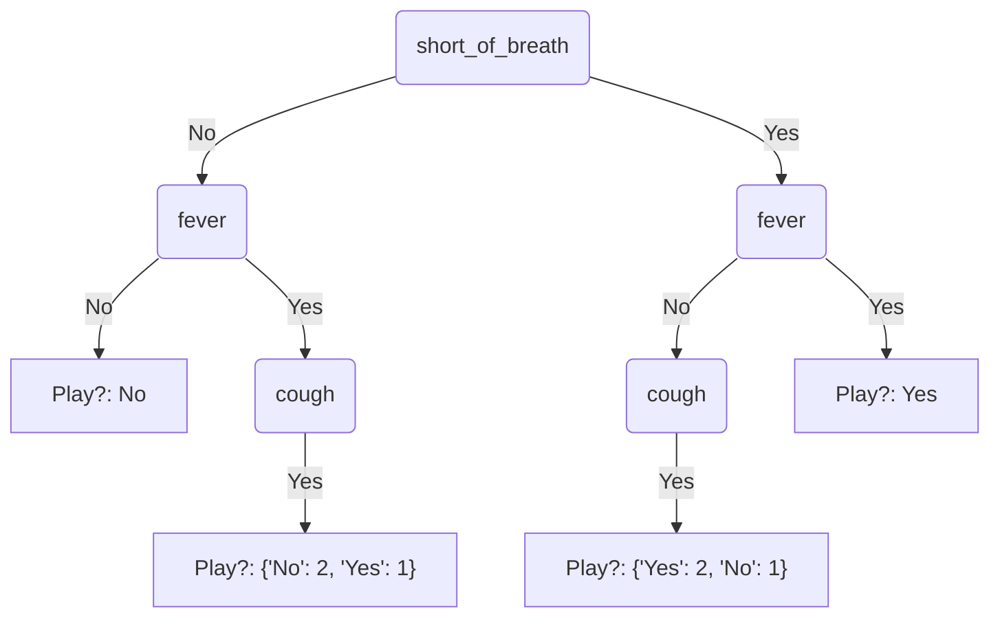

# Decision trees

Check decision tree creation here: <https://planetcalc.com/8443/>

Requirements: pandas and numpy

Run the tree:

```bash
python main.py
```

Run tests:

```bash
python -m pytest tests
```

In the future it would be better to create a framework that allows to create a specific type for the decision tree query.  

## Diagrams

From [example.csv](./dataset/example.csv):



From [id3.csv](./dataset/id3.csv)


