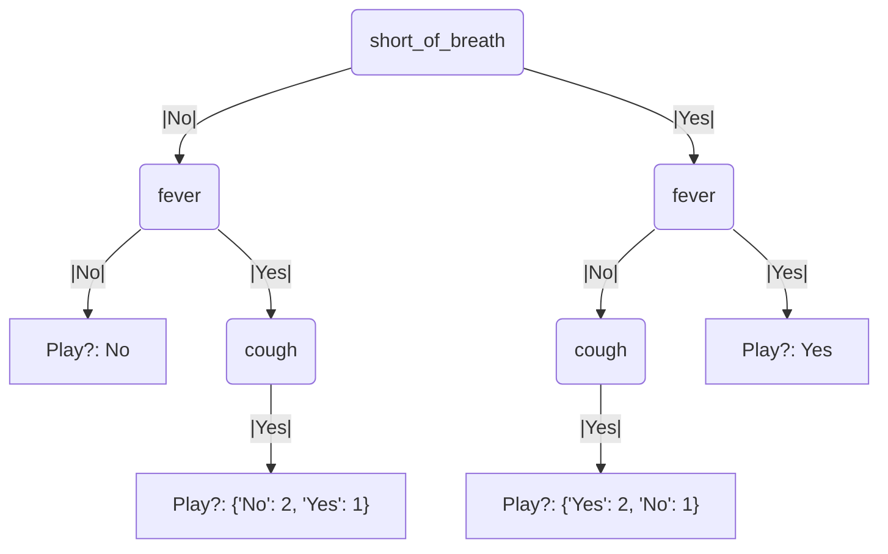
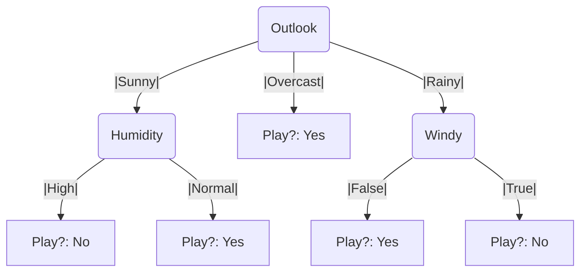

# Diagram

```mermaid
graph TB
    node_short_of_breath_("short_of_breath")
    node_fever_No("fever")
    leaf_No_No["Play?: No"]
    node_cough_Yes("cough")
    leaf___No___2___Yes___1__Yes["Play?: {'No': 2, 'Yes': 1}"]
    node_fever_Yes("fever")
    node_cough_No("cough")
    leaf___Yes___2___No___1__Yes["Play?: {'Yes': 2, 'No': 1}"]
    leaf_Yes_Yes["Play?: Yes"]

    node_short_of_breath_ --|No|--> node_fever_No
    node_fever_No --|No|--> leaf_No_No
    node_fever_No --|Yes|--> node_cough_Yes
    node_cough_Yes --|Yes|--> leaf___No___2___Yes___1__Yes
    node_short_of_breath_ --|Yes|--> node_fever_Yes
    node_fever_Yes --|No|--> node_cough_No
    node_cough_No --|Yes|--> leaf___Yes___2___No___1__Yes
    node_fever_Yes --|Yes|--> leaf_Yes_Yes

```

```mermaid
graph TB
    node_Outlook_("Outlook")
    node_Humidity_Sunny("Humidity")
    leaf_No_High["Play?: No"]
    leaf_Yes_Normal["Play?: Yes"]
    leaf_Yes_Overcast["Play?: Yes"]
    node_Windy_Rainy("Windy")
    leaf_Yes_False["Play?: Yes"]
    leaf_No_True["Play?: No"]

    node_Outlook_ --|Sunny|--> node_Humidity_Sunny
    node_Humidity_Sunny --|High|--> leaf_No_High
    node_Humidity_Sunny --|Normal|--> leaf_Yes_Normal
    node_Outlook_ --|Overcast|--> leaf_Yes_Overcast
    node_Outlook_ --|Rainy|--> node_Windy_Rainy
    node_Windy_Rainy --|False|--> leaf_Yes_False
    node_Windy_Rainy --|True|--> leaf_No_True
```